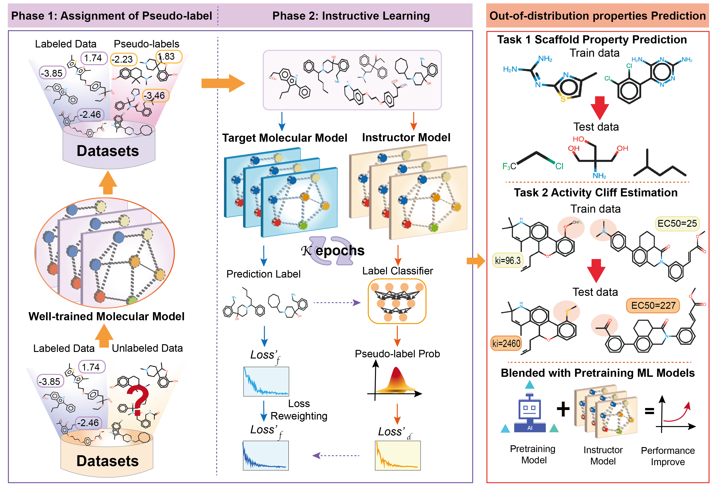

# Instructor-inspired Machine Learning Enables Accurate OOD and Activity Cliffs Molecular Property Prediction (NeurIPS 2024) 🐉


  
This is the official repository for the paper **Instructor-inspired Machine Learning Enables Accurate Out-of-distribution and Activity Cliffs Molecular Property Prediction** 
[[arXiv]](https://arxiv.org/abs/2304.03906). We propose a novel and efficient semi-supervised learning framework to overcome the limitation of labeled data scarcity and the difficulty of
annotating molecular data. We conduct extensive experiments in MoleculeNet [[1]](#1) and MoleculeACE [[2]](#2) to verify the efficacy of our InstructMol and further results show that 
InstructMol can be collaborated with pretrained molecular models such as GEM [[3]](#3) to achieve better performance. Besides, we validate that
we can adopt molecular models trained by InstructMol to build large-scale and task-specific pseudo-labeled molecular datasets, which can
be reused to train other kinds of molecular models and obtain a more powerful representation capability.
<p align="center"></p>


<!-- TABLE OF CONTENTS -->
<h2 id="table-of-contents"> Table of Contents</h2>
<details open="open">
  <summary>Table of Contents</summary>
  <ol>
    <li><a href="#Prerequisites"> ➤ Prerequisites</a></li>
    <li><a href="#LabeledData-Preparation"> ➤ LabeledData Preparation</a>
          <ul>
            <li><a href="#unlabeled-data">Unlabeled LabeledData</a></li>
            <li><a href="#moleculenet">Molecular Property Prediction</a></li>
            <li><a href="#ace">Activity Cliff Estimation</a></li>
          </ul>
    </li>
    <li><a href="#Getting-started"> ➤ Getting started</a>
          <ul>
            <li><a href="#instructmol-model">Train Molecular Models by InstructMol</a></li>
            <li><a href="#teacher-model">Train Molecular Models on a Hybrid Dataset</a></li>
          </ul>
    </li>
    <li><a href="#How-to-cite"> ➤ How to cite</a></li>
    <li><a href="#License"> ➤ Licence</a></li>
    <li><a href="#Acknowledgement"> ➤ Acknowledgement</a></li>
  </ol>
</details>


<h2 id="Prerequisites">Prerequisites</h2>

InstructMol currently supports Python 3.7. We rely on [PyTorch](https://pytorch.org/) (1.10.0) and 
[PyTorch Geometric](https://pytorch-geometric.readthedocs.io/en/latest/) (2.2.0) to execute the code. 
Notably, please do not install MoleculeACE by `pip install MoleculeACE`, because we make necessary modifications on its original implementation.
Please follow the instructions below to install the necessary environment. 

```markdown
pip install torch    # we use torch 1.10.0 & cu113
pip install -U scikit-learn
pip install torch-cluster -f https://data.pyg.org/whl/torch-1.10.0+cu113.html
pip install torch-scatter -f https://data.pyg.org/whl/torch-1.10.0+cu113.html 
pip install torch-sparse -f https://data.pyg.org/whl/torch-1.10.0+cu113.html 
pip install torch-geometric
```

<h2 id="LabeledData-Preparation">LabeledData Preparation</h2>

Before implementation of InstructMol, we need to acquire both the labeled and unlabeled molecular data. In the main text, we select two categories of 
problems: molecular property prediction and the activity cliff estimation. 

<h3 id="unlabeled-data">Unlabeled LabeledData</h3>

Unlabeled data are collected from the common database [ZINC15](https://zinc15.docking.org/), a free database of commercially available compounds for virtual screening.
ZINC15 contains over 230 million purchasable compounds in ready-to-dock, 3D formats. You can use DeepChem to attain the unlabeled SMILES of molecules
via the following script:

```markdown
https://github.com/deepchem/deepchem/blob/master/deepchem/molnet/load_function/zinc15_datasets.py
```
There are four different sizes of ZINC15: 250K, 1M, 10M, and 270M. We only utilize the 250K and 1M versions.

<h3 id="moleculenet">Molecular Property Prediction</h3> 

We adopt the MoleculeNet [[1]](#1) as the benchmark to evaluate our model for molecular property prediction, where 3 regression tasks and
6 classification tasks are selected. The data can be obtained from either the official website of MoleculeNet at this [link](https://moleculenet.org/datasets-1) or from GEM [[3]](#3) by
running the following line:

```
wget https://baidu-nlp.bj.bcebos.com/PaddleHelix/datasets/compound_datasets/chemrl_downstream_datasets.tgz
```
Notably, before using them, you need to rename the file names rather than putting them into the folder `MoleculeACE/benchmark/LabeledData/benchmark_data`. 
The name dictionary is listed as follows: `['freesolv', 'esol', 'lipo', 'bbbp', 'bace', 'clintox', 'tox21', 'toxcast', 'sider']`.
For convenience, we have provided preprocessed MoleculeNet datasets in this repository, and you can directly run relevant tasks.
We employ a scaffold splitting to split the dataset into training/validation/test sets. The splitter can be found at `MoleculeACE/benchmark/utils.py`.

<h3 id="ace">Activity Cliff Estimation</h3>

We use the MoleculeACE [[2]](#2) benchmark to validate the capability of our InstructMol in addressing the activity cliff estimation. MoleculeACE contains 
30 datasets, each corresponding to a target macromolecule. Its data is available at its official GitHub at this 
[URL](https://github.com/molML/MoleculeACE/tree/main/MoleculeACE/Data/benchmark_data), where data splits are already provided. 
Then you need to put the data (in `.csv`) under the folder `MoleculeACE/benchmark/LabeledData/benchmark_data` and
we use a stratified scaffold splitting to evaluate the performance of different GNNs. 


<h2 id="Getting-started">Getting started</h2>
<h3 id="instructmol-model"> Train Molecular Models by InstrutMol</h3>

In order to realize the semi-supervised learning of our InstrutMol, please run the following line of code:  

```markdown
python main.py ./configs/ace.yml --model=MPNN --data=CHEMBL4203_Ki
python main.py ./configs/molnet.yml --model=MPNN --data=bbbp
```
where you can change the model type from `['GCN', 'GIN', 'GAT']`. You can also choose the dataset by altering `--data` argument from 
`['CHEMBL4203_Ki', 'CHEMBL2034_Ki', 'CHEMBL233_Ki', 'CHEMBL4616_EC50', 'CHEMBL287_Ki', 'CHEMBL218_EC50', 'CHEMBL264_Ki', 'CHEMBL219_Ki',
'CHEMBL2835_Ki', 'CHEMBL2147_Ki', 'CHEMBL231_Ki', 'CHEMBL3979_EC50', 'CHEMBL237_EC50', 'CHEMBL244_Ki', 'CHEMBL4792_Ki', 'CHEMBL1871_Ki',
'CHEMBL237_Ki', 'CHEMBL262_Ki', 'CHEMBL2047_EC50', 'CHEMBL239_EC50', 'CHEMBL2971_Ki', 'CHEMBL204_Ki', 'CHEMBL214_Ki', 'CHEMBL1862_Ki',
'CHEMBL234_Ki', 'CHEMBL238_Ki', 'CHEMBL235_EC50', 'CHEMBL4005_Ki', 'CHEMBL236_Ki', 'CHEMBL228_Ki']`. You can control the number of 
unlabeled data size via `--unlabeled_size` to use only a portion of all available unlabeled data.
You can also add an extra command `--debug` to only run one fold for debugging. Many other kinds of arguments are supported as well, and please 
check the code for details. Notably, in order to speed up the training for different tasks with the same unlabeled database, we save the processed unlabeled data file the 
first time reading these unlabeled data points.

<h3 id="teacher-model"> Train Molecular Models on a Hybrid Dataset</h3>

We can also use a molecular model well-trained by InstructMol to produce a hybrid dataset and use that hybrid dataset to train other deep learning 
architectures. This can be done by running the following code:

```markdown
python teacher_main.py ./configs/teacher.yml --model=GIN --data=CHEMBL4203_Ki
```
where you need to specify the type of the student model and the teacher model (*e.g.,* the one to annotate the unlabeled corpus) in `teacher.yml`. 

<h2 id="How-to-cite">How to cite</h2>

If you find our paper helpful and interesting, please consider citing our paper. Thank you! :) 
Any kind of question is welcome, and you can directly pull an issue or send emails to [Fang WU](mailto:fangwu97@stanford.edu). 
We are pleased to see future works based on our InstructMol to push the frontier of molecular representation learning through semi-supervised learning. 

```markdown
@article{wu2024instructor,
  title={Instructor-inspired machine learning for robust molecular property prediction},
  author={Wu, Fang and Jin, Shuting and Li, Siyuan and Li, Stan Z},
  journal={Advances in Neural Information Processing Systems},
  volume={37},
  pages={116202--116222},
  year={2024}
}
```

<h2 id="Acknowledgement">Acknowledgement</h2>
We would like to thank Dr. Wenhao Gao, Dr and Connor W. Coley from MIT for their valuable advice during the research period of InstructMol. 
We would also want to express our gratitude to Dr. Siqi Sun from Fudan University, who also gave important help to our study, and MoleculeMind, for
offering sufficient computational resources to support this project. 


<h2 id="License">License</h2>

InstructMol is under MIT license. For the use of specific models, please refer to the model licenses found in the original packages.


## References
<a id="1">[1]</a> 
Wu, Zhenqin, et al. "MoleculeNet: a benchmark for molecular machine learning." Chemical Science 9.2 (2018): 513-530.   
<a id="2">[2]</a> 
van Tilborg, Derek, Alisa Alenicheva, and Francesca Grisoni. "Exposing the limitations of molecular machine learning with activity cliffs."
Journal of Chemical Information and Modeling 62.23 (2022): 5938-5951.   
<a id="3">[3]</a> 
Fang, Xiaomin, et al. "Geometry-enhanced molecular representation learning for property prediction." Nature Machine Intelligence 4.2 (2022): 127-134.   
